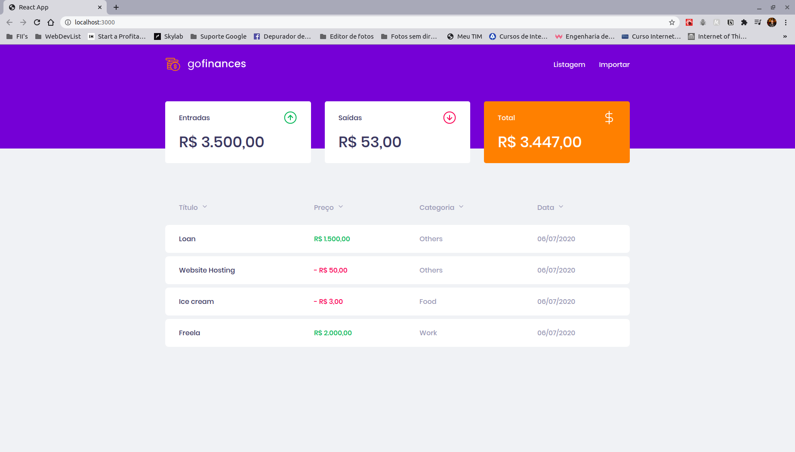

# GoFinances

## :black_nib: About the app

GoFinances is an application for finances management, which shows the history of expenses and your current balance. It is also possible to import csv files to add new financial transactions.

<h3 align="center"> :computer: Web app </h3>

<h1 align="center">
    
</h1>

## :rocket: Run the app

To run on your computer, you need:
  - **Node**
  - A package manager like **NPM** or **Yarn**
  - **PostgreSQL** or Docker, to enable a PostgreSQL database

1. Cloning the repo

```sh
  $ git clone https://github.com/MatheusChein/GoFinances.git
```

2. Running the app:
  - Using npm

```sh
  # Install dependencies
  $ npm install

  ## Create the database
  $ cd server
  $ npm run typeorm migration:run

  # Start the server
  $ npm run dev:server

  # Start the app
  $ cd web
  $ npm start
```
 - Using yarn

```sh
  # Install dependencies
  $ yarn

  ## Create the database
  $ cd server
  $ yarn typeorm migration:run

  # Start the server
  $ yarn dev:server

  # Start the web app
  $ cd web
  $ yarn start
```
## :toolbox: Technologies used

<ul>
<li>React</li>
<li>Typescript</li>
<li>TypeORM</li>
<li>PostgreSQL</li>
<li>Axios</li>
<li>ESLint</li>
<li>Prettier</li>
</ul>

## :man_technologist: Features

<ul>
<li>Componentization</li>
<li>React States</li>
<li>React Hooks</li>
<li>Custom React Component Properties</li>
<li>ES6+ Destructuring</li>
<li>Decorators</li>
<li>Ternary Conditioning</li>
<li>Import / Export statements</li>
</ul>

## :memo: License

This project is under the MIT license. Check out the [LICENSE](LICENSE.md) file for further details.

## :briefcase: Contact me <br>

[](https://www.linkedin.com/in/matheus-chein/) 
[](mailto:matheuschein@gmail.com)
